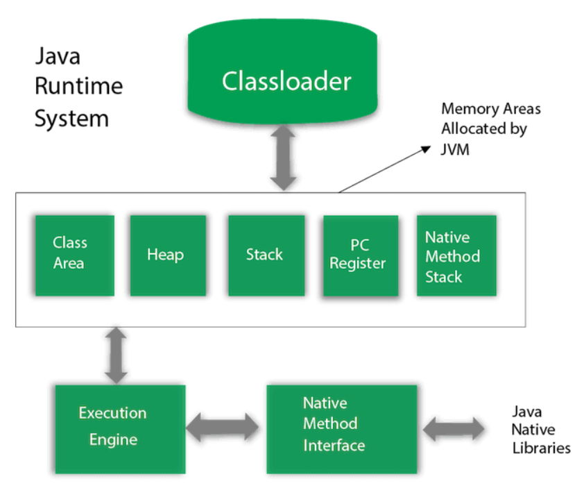
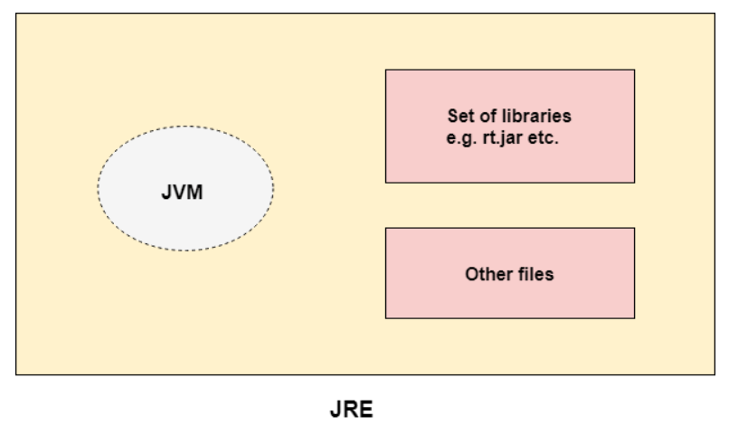
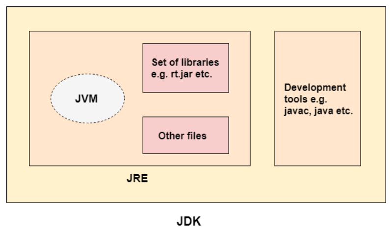

# Chapter 02 - JVM, JRE & JDK

## Java Virtual Machine (JVM)

- A virtual sandbox for executing the program.
- It is called virtual machine because it doen't exists physically.
- A sandbox where bytecode is executed.
- JVMs are available for different hardware and software.
- Although Java is platform independent, JVM is platform dependent.
- The JVM performs the following tasks:
  - Loads code
  - Verifies code
  - Executes code

### JVM Architecture

#### Classloader

- Subsystem of Java that loads the class file.
- Whenever we run Java program, it is first loaded by the classloader.
- Three built-in classloaders:
  - Bootstrap classloader
  - Extension classloader
  - System/Application classloader

#### Class Area

- Stores class structure.

#### Heap

- Memory where objects are stored.

#### Stack

- Memory where local variables and partial results are stored.
- Plays vital role in method invocation and storing returned value.

#### Program Counter Register

- PC (Program counter register) contains the address of the Java virtual machine instruction currently being executed.

#### Native method stack

- Contains all native methods used in the application.

#### Execution engine

- It contains:
  - A virtual processor.
  - Interpreter: Read bytecode stream then execute the instructions.
  - Just-in-time (JIT) compiler:
    - Used to improve performance.
    - Compiles part of the bytecode that has similar functionality at the same time.
    - Hence, reduces the amount of time needed for compilation.

#### Java Native Interface

- JNI is a framework which provides interface to communicate with other application written in other language like C, C++, Assembly, etc.
- Java uses JNI framework to send output to console or interact with OS libraries.

## Java Runtime Environment (JRE)

- Set of software tools which are used for developing Java applications.
- Used to provide the runtime environment.
- It physically exists.
- It contains a set of libraries + other files that JVM uses at runtime.

## Java Development Kit (JDK)

- Software development environment which is used to develop Java applications.
- It physically exists.
- It contains JRE + development tools.
- Contains a private Java Virtual Machine (JVM) and a few other resources such as an interpreter/loader (java), a compiler (javac), an archiver (jar), a documentation generator (Javadoc), etc. to complete the development of a Java Application.

