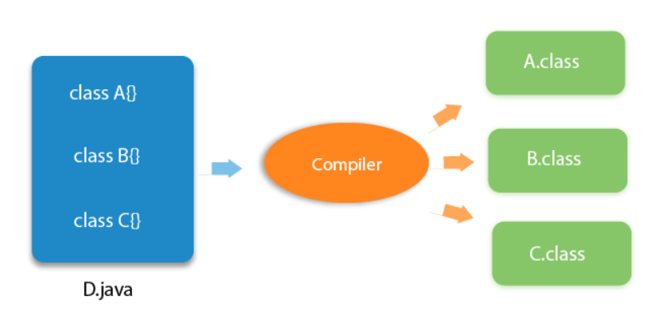

# Printing "Hello"

```java
public class Main {
  public static void main(String[] args) {
    System.out.println("Hello");
  }
}
```

- Save the above file as `Main.java`.
- Compile it using `javac Main.java` command.
- Execute it using `Main` command.

```
Output: Hello
```

### Compilation flow

- Main.java (Source code) → Compiler → Main.class (Bytecode)

### Runtime flow

- Class file → Classloader → Bytecode verifier → Interpreter → Runtime → Hardware

## Parameters used in the above code

- **`class`**

  - Used to declare a class in Java.

- **`public`**

  - Access modifier that represents visibility.

- **`static`**

  - Keyword used to declare static variables and methods.

- **`void`**

  - Return type of method.

- **`main`**

  - Starting point of the program.

- **`System.out.println()`**
  - Method used to print something on the console.

## Valid Java `main()` method signatures

```java
public static void main(String[] args)
public static void main(String []args)
public static void main(String args[])
public static void main(String... args)
static public void main(String[] args)
public static final void main(String[] args)
final public static void main(String[] args)
final strictfp public static void main(String[] args)
```

## Invalid Java `main()` method signatures

```java
public void main(String[] args)
static void main(String[] args)
public void static main(String[] args)
abstract public static void main(String[] args)
```

### Note:

- Having a semicolon at the end of the class is optional.

```java
class Main {
  public static void main(String[] args) {
    System.out.println("Hello");
  }
};
```

# Interview Questions

### Can you save a Java source file by another name than the class name?

- Yes, if the class in not public.

### Can you have multiple classes in a Java source file?

- Yes.


