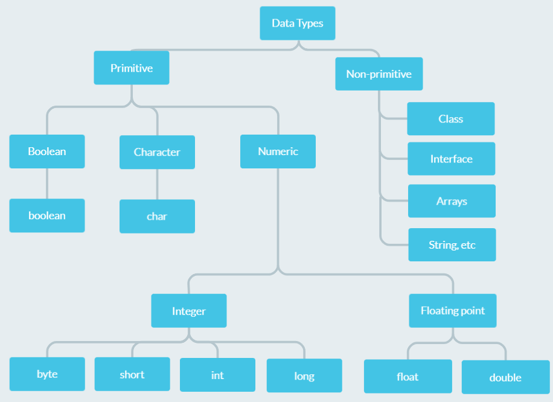

# Variables

- Container which holds data.
- Name of the memory location.
- Assigned with data type.
- Java is statically typed language which means all the variables must be declared before its use.
- Use camelcase as a naming convention.

# Data types

- Specifies the different sizes and values that can be stored in the variable.
- Two types:
  - Primitive data types: `boolean`, `char`, `byte`, `short`, `int`, `long`, `float` and `double`.
  - Non-primitive data types: Classes, Interfaces, Arrays, String, etc.



## Syntax for defining a variable

```java
data_type variable_name = value;

// Example
int age = 18;
```

## Primitive data types

- Data types which are known to Java.
- Building blocks for data manipulation.

### NOTE:

- Formula to calculate the range of any data type is as follows:
  **-(2<sup>n - 1</sup>) to (2<sup>n-1</sup>) - 1**

### `boolean`

- Used to store either `true` or `false`.
- **Size:** 1 bit but not precisely.
- **Default value:** `false`
- **Example:**

  ```java
  boolean isEligible = true;
  ```

### `char`

- Used to store 16-bit unicode characters.
- **Size:** 2 bytes
- **Default value:** `\u0000`
- **Range:** `\u0000` to `\uFFFF`
- **Example:**

  ```java
  char response = 'Y';
  ```

### `byte`

- 8-bit signed two's complement integer.
- **Size:** 1 byte or 8-bit
- **Default value:** 0
- **Range:** -127 to 128 (inclusive)
- **Example:**
  ```java
  byte a = 10;
  ```

### `short`

- 16-bit signed two's complement integer.
- **Size:** 2 bytes
- **Default value:** 0
- **Range:** -32,768 to 32,767 (inclusive)
- **Example:**
  ```java
  short s = 12000;
  ```

### `int`

- 32-bit signed two's complement integer.
- **Size:** 4 bytes
- **Default value**: 0
- **Range:** -2,147,483,648 (-2^31) to 2,147,483,647 (2^31 -1) (inclusive)
- **Example:**
  ```java
  int s = -10000;
  ```

### `long`

- 64-bit signed two's complement integer.
- **Size:** 8 bytes
- **Default value**: 0L
- **Range:** -9,223,372,036,854,775,808(-2^63) to 9,223,372,036,854,775,807(2^63 -1)(inclusive)
- **Example:**
  ```java
  long b = -200000L;
  ```

### `float`

- Single-precision 32-bit IEEE 754 floating point.
- **Size:** 4 bytes
- **Default value**: 0.0f
- **Range:** Unlimited
- **Example:**
  ```java
  float f = 10.87f;
  ```

### `double`

- Double-precision 64-bit IEEE 754 floating point.
- **Size:** 8 bytes
- **Default value**: 0.0d
- **Range:** Unlimited
- **Example:**
  ```java
  double d = 10.876334f;
  ```

# Types of variables

## Local variable

- Declared inside the body of the method.
- Can be used only within that method.
- Other methods in the class aren't aware of its existence.
- Cannot be defined with `static` keyword.

## Instance variable

- Declared inside the class but outside the body of the method.
- Not declared as `static`.
- Its value is specific for a particular instance and is not shared among other instances.

## Static variable

- Declared using `static` keyword.
- Cannot be local.
- You can create a single copy of the static variable and share it among all the instances of the class.
- Memory allocation for static variables happens only once when the class is loaded in the memory.

## Examples of types of variable

```java
class Main {
  int a; // instance variable
  static int b; // static variable

  public static void main(String[] args) {
    int c = 98; // local variable
  }
}
```
