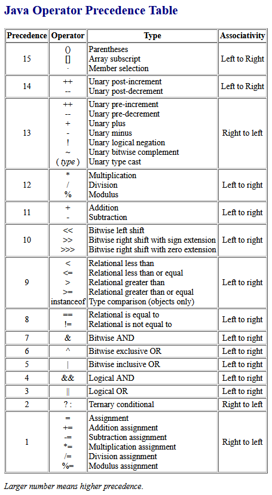

# Operators in Java

## Assignment operator (=)

- Used to assign value to a variable.

```java
int a = 10;
```

## Arithmetic operators

- Used to perform simple arithmetic operations.
- Following are the arithmetic operators:
  - Addition operator (`+`)
  - Subtraction operator (`-`)
  - Multiplication operator (`*`)
  - Division operator (`/`)
  - Modulo operator (`%`)

```java
int a = 10, b = 3;
System.out.println(a + b); // Addition
System.out.println(a - b); // Subtraction
System.out.println(a * b); // Multiplication
System.out.println(a / b); // Division -> returns quotient
System.out.println(a % b); // Modulo -> returns remainder
```

```
Output:
13
7
30
3
1
```

## Relational operators

- Used to check relations like equality, greater than, less than, etc.
- Returned result is `boolean`
- Used in if-else and looping statements.
- Following are the relational operators:
  - Equal to (`==`)
  - Not equal to (`!=`)
  - Greater than (`>`)
  - Greater than equal to (`>=`)
  - Less than (`<`)
  - Less than equal to (`<=`)

```java
int a = 10, b = 3;
System.out.println(a == b); // false
System.out.println(a != b); // true
System.out.println(a > b); // true
System.out.println(a >= b); // true
System.out.println(a < b); // false
System.out.println(a <= b); // false
```

## Logical operators

- Used to perform functions similar to AND gate, OR gate etc.
- Short circuiting takes place depending on the value of initial condition.
- Logical AND (`&&`) → Any false = false
- Logical OR (`||`) → Any true = true
- Logical NOT (`!`)

```java
int a = 10, b = 3;
System.out.println((a == 10) && (a > b)); // true
System.out.println((a == 9) || (a > b)); // true
System.out.println(!(a == 10)); // false
```

## Unary operators

- Works on only one operand.
- Used to increment, decrement or negate value.
- Unary minus (`-`) → Used to represent negative values.
- Unary plus (`+`) → Used to represent positive values, however its optional.
- Increment operator (`++`) → Increment value by 1.
  - Pre-increment operator → First increment then use.
  - Post-increment operator → First use then increment.
- Decrement operator (`--`) → Decrements value by 1.
  - Pre-decrement operator → First decrement then use.
  - Post-decrement operator → First use then decrement.

```java
// Pre increment
int a = 10;
int b = ++a;
System.out.println(a); // 11
System.out.println(b); // 11

// Post increment
int a = 10;
int b = a++;
System.out.println(a); // 11
System.out.println(b); // 10

// Pre decrement
int a = 10;
System.out.println(a); // 10
System.out.println(--a); // 9
System.out.println(a); // 9

// Post decrement
int a = 10;
System.out.println(a); // 10
System.out.println(a--); // 10
System.out.println(a); // 9
```

## Conditional operator or Ternary operator (`?:`)

- Shorthand version of if-else statement.

```java
int age = 18;
boolean isEligible = (age >= 18 ? true : false);
System.out.println(isEligible); // true
```

## Bitwise operators

- Used to manipulate individual bits of a number.
- Can be used with any of the integer types.
- Use logic gates concept.
- Bitwise AND (`&`)
- Bitwise OR (`|`)
- Bitwise XOR (`^`) → Opposites = 1, else 0
- Bitwise complement (`~`) → Returns 1’s complement representation of the input value i.e., with all bits inverted.

```java
int a = 2, b = 3;
System.out.println(a & b); // 2 (AND gate)
System.out.println(a | b); // 3 (OR gate)
System.out.println(a ^ b); // 1 (XOR gate)

// Complement
0 -> 1
1 -> 0
~2 -> ~ 0010 = 1101 = -101 = -3 because 1st bit is sign bit so 1 means -ve.
~3 -> ~ 0011 = 1100 = -100 = -4 because 1st bit is sign bit so 1 means -ve.

System.out.println(~a); // -3 (1's complement of 2 where 1st bit will be for sign)
System.out.println(~b); // -4 (-1's complement of 3 where 1st bit will be for sign)
```

## Shift operators

- Used to shift the bits of a number left or right, thereby multiplying or dividing the
  number by two, respectively.
- Left shift (`<<`) → shifts the bits of the number to the left and fills 0 on voids left
  as a result. Similar effect as of multiplying the number with some power of two.
- Signed right shift (`>>`) → shifts the bits of the number to the right and fills 0 on
  voids left as a result. The leftmost bit depends on the sign of the initial number.
  Similar effect as of dividing the number with some power of two.
- Unsigned right shift (`>>>`) → shifts the bits of the number to the right and fills 0
  on voids left as a result. The leftmost bit is set to 0.

```java
Syntax:
number shift_op number_of_places_to_shift;

Left shift
b = a << n -> b = a * (2 ^ n)

Right shift
b = a >> n -> b = a / (2 ^ n)

int a = 2;
System.out.println(a << 3); // 2 * (2 ^ 3) = 16
System.out.println(a >> 3); // 2 / (2 ^ 3) = 0
System.out.println(a >>> 3); // 0 (does not preserve sign bit)
```

## `instanceof` operator

- Used for type checking.
- Used to test if an object is an instance of a class, a subclass or an interface.
- Covered in OOP module.

## Operator precedence and associativity


