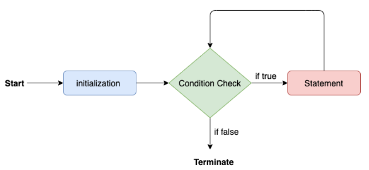
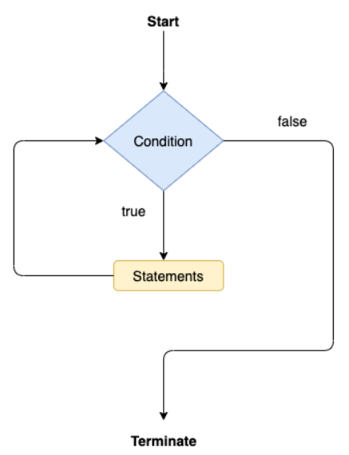
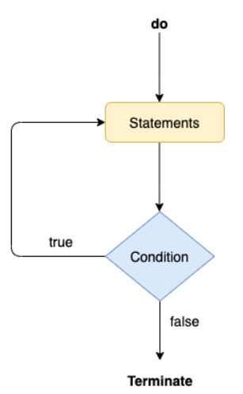

# Decision making statements

## `if` statement

```java
if(condition) {
  statements; // executes only when condition is true
}
```

## `if-else` statement

```java
if(condition) {
  statement 1; // executes when condition is true
} else {
  statement 2; // executes when condition is false
}
```

## `if-else-if` ladder

```java
if(condition 1) {
  statement 1; // executes when condition 1 is true
} else if(condition 2) {
  statement 2; // executes when condition 2 is true
} else {
  statement 3; // executes when all the conditions are false
}
```

## Nested `if` statement

```java
if(condition 1) {
  if(condition 2) { // flow comes here only if condition 1 is true
    statements;
  }
}else {
  statements;
}
```

## `switch` case

- Similar to `if-else-if`.
- Single case is executed at a time.
- Enhances the readability of code.
- The case variables can be `char`, `byte`, `short`, `int`, `String` or enumeration.
- Cases cannot be duplicate.
- Default statement is executed when any of the case doesn't match the value of expression. It is optional.
- `break` statement terminates the switch block when the condition is satisfied. It is optional, if not used, next case is executed.
- While using switch statements, we must notice that the case expression will be of the same type as the variable. However, it will also be a constant value.
- Syntax:

```java
switch(expression) {
  case value 1:
    statement 1;
    break;
    .
    .
    .
    case value n:
      statement n;

    default:
      default statement;
}
```

# Looping Statements

- Looping statements are used to execute the set of instructions in a repeated order.

## `for` loop

- Use it when you know the number of iterations in advance.

```java
for(initialization; condition; updation) {
  // statements
}
```



## `for-each` loop

- Enhanced `for` loop to traverse data structures like arrays or collection.
- No need to update the loop variable.

```java
for(data_type var : array_name/collection_name) {
  statements;
}
```

## `while` loop

- Use it when you are unaware of the number of interations in advance.
- Called as entry-controlled loop as condition is checked at the start of the loop.

```java
while(condition) {
  // statements
}
```



## `do-while` loop

- Use it when you are unaware of the number of iterations but you want to execute the loop atleast for once.
- Called as exit-controlled loop since the condition is not checked in advance.

```java
do {
  statments;
} while(condition);
```



# Jump statements

- Used to transfer control of the program to the specific statements.

## `break` statement

- Used to break the flow of loop or statement and transfer to the next statement.

```java
for(int i = 1; i <= 5; i++) {
  if(i == 3)
    break;
  System.out.println(i);
}
```

```
Output:
1
2
```

## `continue` statement

- Used to skip an iteration.
- Doesn't break the flow.

```java
for(int i = 1; i <= 5; i++) {
  if(i == 3)
    continue;
  System.out.println(i);
}
```

```
Output:
1
2
4
5
```
