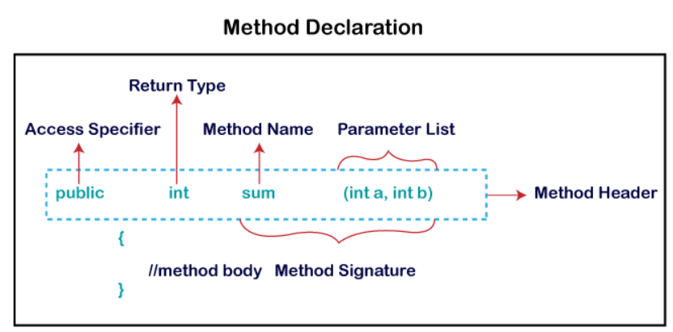

# Method in Java

- Collections of instructions grouped together to perform a specific task.
- Provides reusability of code.
- We write the method once and use it as many times as we want.
- Method is executed only when we call or invoke it.
- `main()` method is the most important method in Java.

## Method declaration



- **Method signature**: Includes method name and parameter list.
- **Access modifier**: Specifies the visibility of the method.
- **Return type**: Data type the method returns.
- **Method name**: Unique name used to define the name of method. Must be corresponding to the functionality of the method. Method is invoked by this name.
- **Parameter list**: List of parameters ie data type and variables seperated by comma and enclosed in the pair of parantheses.
- **Method body**: Contains all the actions to be performed.

## Naming convention

- Use verb and camelcase.

## Types of method

### Predefined method

- Methods that are already defined in Java class libraries.
- Also called as Standard Library Method or Built-in method.
- Each and every predefined method is defined inside a class.
- Such as `print()` method is defined in the `java.io.Printstream` class.

### User-defined method

- Method written by the user or programmer is known as a user-defined method.
- These methods can be modified according to the requirements.

```java
class Main {
  // User-defined method
  public int sum(int a, int b) {
    return a + b;
  }

  // main() method
  public static void main(String args[]) {
    System.out.println(sum(1, 2)); // Calling method and printing the result
  }
}
```

### Static method

- Defined using `static` keyword.
- Method belongs to class rather than the instance of the class.
- We can call static methods without creating object for it.
- It can access static data and can also change its value.
- Best example is `main()` method.

### Instance method

- Method of class.
- Non-static method defined in the class.
- Necessary to create an object of its class before invoking.

### Abstract method

- Method that does not has body or a method without implementation.
- Always declared in `abstract` class.
- We use `abstract` keyword to declare a method as abstract.

#### Note: All the types of methods are covered in more details in OOP.
