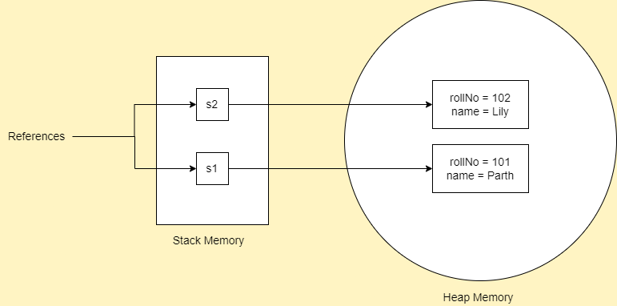

# Class

- A class is a blueprint or template from which objects are created.
- It is a logical entity.
- A class can contain:
  - Data members
  - Methods
  - Constructors
  - Blocks
  - Nested classes and interfaces, etc.

## Naming Convention

- Pascal case ie first letter of each word is capital.
- Use nouns.
- Eg, Vehicle, AxisBank, etc.

## Syntax of class

```java
class ClassName {
  // Data members
  // Constructors
  // Methods, etc
}
```

Example:

```java
public class Student {
  // Data members or instance variables
  String name;
  int age;

  // Constructor
  public Student() {}

  // Methods
  String getName() {
    return name;
  }

  int getAge() {
    return age;
  }
}
```

# Object

- An entity that has state and behavior.
- For eg, a chair, pen, table, etc.
- It can be physical or logical.
- It is an instance(result) of a class.
- Takes some space in heap memory.
- An object has three characteristic:
  - **State:** represents the value of the object.
  - **Behavior:** represents the functionality of the object.
  - **Identity:** Each object is given a unique ID so that JVM can uniquely identify each object.
- For eg, consider an object Dog, its name is Max which is its state.
- It eats, barks, runs, etc which is its behavior.

## `new` keyword in Java

- Used to create objects.
- Used to allocate memory at runtime.

## Syntax for creating an object

```java
ClassName reference = new Constructor();
```

Example:

```java
// Creating an object of class Student
Student s1 = new Student();
s1.name = "Parth"; // Setting the state of the object ie setting the value of the member variable

System.out.println(s1.getName()); // Behavior of the object ie fetches the name
System.out.println(s1); // @5acf9800 -> A unique value generated by JVM that identifies each object
```

## `main()` within the class

```java
// Main.java
// Defining class Student
  class Student {
	// Data members or instance variables
	int rollNo;
	String name;

	// main() method inside class Student
	public static void main(String[] args) {
		// Creating an object or instance of Student class
		Student s1 = new Student();

		// Accessing the data members using the reference s1

		System.out.println(s1.rollNo);
		System.out.println(s1.name);
	}
}
```

```
Output:
0
null
```

- `0` and `null` are default values of `int` and `String` respectively.
- As instance variables are not initialize explicitly, their default value is returned.

## `main()` outside the class

```java
// Student.java
class Student {
  int rollNo;
  String name;
}

// Main.java
class Main {
  public static void main(String args[]) {
    Student s1 = new Student();
    System.out.println(s1.rollNo);
    System.out.println(s1.name);
  }
}
```

```
Output:
0
null
```

- A better approach is to create a `Main` class for `main()` method only.
- We can use one class from another class.
- We can also use multiple classes in same class, but the file name should be named after the class which contains the `main()` method.

## Ways to initialize object

1. By reference variable
2. By method
3. By constructor (Will learn in paramaterized constructor)

### Initializing object using reference variable

```java
// Student.java
class Student {
  int rollNo;
  String name;
}

// Main.java
class Main {
  public static void main(String args[]) {
    Student s1 = new Student();
    s1.id = 101;
    s1.name = "Parth";

    System.out.println(s1.rollNo);
    System.out.println(s1.name);
  }
}
```

```
Output:
101
Parth
```

### Initializing object using method

```java
class Student {
  int rollNo;
  String name;

  void insertData(int r, String n) {
    rollNo = r;
    name = n;
  }
}

class Main {
  public static void main(String args[]) {
    Student s1 = new Student();
    s1.insertRecord(101, "Parth");

    System.out.println(s1.rollNo + " " + s1.name);
  }
}
```

```
Output:
101 Parth
```

## Memory allocation for object

```java
class Student {
  int rollNo;
  String name;

  void insertData(int r, String n) {
    rollNo = r;
    name = n;
  }
}

class Main {
  public static void main(String args[]) {
    Student s1 = new Student();
    s1.insertData(101, "Parth");
    System.out.println(s1.rollNo + " " + s1.name);

    Student s2 = new Student();
    s2.insertData(102, "Lily");
    System.out.println(s2.rollNo + " " + s2.name);
  }
}
```

```
Output:
101 Parth
102 Lily
```



- The object gets its memory in heap memory area.
- The reference variables are stored in stack memory area.

## Ways of creating object

1. By `new` keyword - most widely used.
2. By `newInstance()` method
3. By `clone()` method
4. By deserialization
5. By factory method, etc.

## Creating multiple objects

- Just like creating multiple variables of same type, we can also create multiple object of same class.

```java
Student s1 = new Student(), s2 = new Student();
```

## Anonymous Objects

- An object with no reference is known as anonymous object.
- If we have to use an object only for once, then anonymous object is a good approach.

```java
new Student(); // Anonymous object

new Student().insertData(103, 'Pushpa'); // calling method using anonymous object
```

# Difference between Object and Class

| Object                                                     | Class                                                            |
| ---------------------------------------------------------- | ---------------------------------------------------------------- |
| Object is an instance of a class.                          | Class is a blueprint or template from which objects are created. |
| Object is a real world entity like pen, table, chair, etc. | Class is group of similar objects.                               |
| Object can by physical or logical entity.                  | Class is a logical entity.                                       |
| Object is mainly created using `new` keyword.              | Class is created using `class` keyword.                          |
| Object is created many times as per requirements.          | Class is only created once.                                      |
| Object is allocated memory once it is created.             | Class is not allocated memory at the time of its creation.       |
