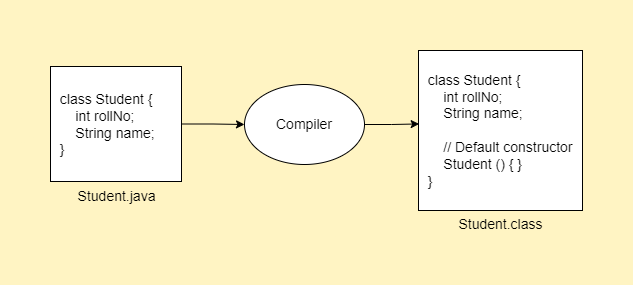

# Constructors in Java

- It is a special type of method which is used to initialize an object.
- It is called by JVM when an instance of class is created.
- At the time of calling a constructor, memory for object is allocated in the heap memory location.
- Every time an object is created using `new` keyword, at least one constructor is called.
- It is called constructor because it constructs the values at the time of object creation.

## Rules for creating a constructor

- Constructor name must be same as its class name.
- Constructor must not have an explicit return type.
- Constructor cannot be `abstract`, `static`, `final` and `synchronized`.
- We can have `private`, `protected`, `default` and `public` constructor.

## Types of constructor

### Default Constructor

- By default, Java compiler provides a constructor called as default constructor.
- It is not necessary to write constructor for the class because Java compiler creates a default constructor when a class doesn't have any constructor defined.
- It is used to provide the default values to the object's property or data members like 0, null, etc., depending on the type.

```java
// Student.java
class Student {
  int rollNo;
  String name;
}

// Main.java
class Main {
  public static void main(String args[]) {
    Student s1 = new Student(); // Invokes default constructor
    System.out.println(s1.rollNo + " " + s1.name);
  }
}
```

```
Output:
0 null
```

- In the `Student` class we are not creating any constructor explicitly, so compiler is providing us with default constructor.
- Here `0` and `null` are the default values that are initialized by the default constructor.



### No argument constructor

- A constructor without any arguments is called as a no-argument or no-args constructor.
- It is same as default constructor but we are explicitly declaring it.

```java
// Bike.java
class Bike {
  // No argument constructor
  Bike() {
    System.out.println("Bike created");
  }
}

// Main.java
class Main {
  public static void main(String args[]) {
    Bike b = new Bike();
  }
}
```

```
Output:
Bike is created
```

### Parameterized Constructor

- A constructor with parameters or arguments is called as Parameterized constructor.
- It is used to intilize the object with specific value.

```java
// Student.java
class Student {
	int rollNo;
	String name;

	// Parameterized constructor
	Student(int r, String n) {
		rollNo = r;
		name = n;
	}

	// Method to display values
	void display() {
		System.out.println(rollNo + " " + name);
	}
}

// Main.java
class Main {
	public static void main(String[] args) {
		Student s1 = new Student(101, "Parth"); // Invoking parameterized constructor
		s1.display();

		Student s2 = new Student(102, "Lily"); // Invoking parameterized constructor
		s2.display();
	}
}
```

```
Output:
101 Parth
102 Lily
```

## Constructor vs Method

| Constructor                                  | Method                                           |
| -------------------------------------------- | ------------------------------------------------ |
| Used to initialize an object                 | Used to perform a specific task                  |
| Must not have a return type                  | Must have a return type                          |
| Invoked implicitly                           | Invoked explicitly                               |
| Java compiler provides a default constructor | Method is not provided by compiler               |
| Constructor name must be same as class name  | Method name may or may not be same as class name |

## Constructor Overloading

- Constructor overloading is a technique of having more than one constructor with different parameter lists.
- They are differentiated by compiler by the number of parameters in the list and their types.

```java
// Student.java
class Student {
	int rollNo;
	String name;
	int age;

	// No argument constructor
	Student() {
	}

	// Parameterized constructor 1
	Student(int r, String n) {
		rollNo = r;
		name = n;
	}

  // Parameterized constructor 2
	Student(int r, String n, int a) {
		rollNo = r;
		name = n;
		age = a;
	}

	// Method to display values
	void display() {
		System.out.println(rollNo + " " + name + " " + age);
	}
}

// Main.java
class Main {
	public static void main(String[] args) {
		Student s1 = new Student(); // Calling no-arg constructor
		Student s2 = new Student(101, "Parth"); // Calling parameterized constructor 1
		Student s3 = new Student(102, "Lily", 22); // Calling parameterized constructor 2

		s1.display();
		s2.display();
		s3.display();
	}
}
```

```
Output:
0 null 0
101 Parth 0
102 Lily 22
```

## Java Copy Constructor

- There is no copy constructor in Java like C++.
- However, we can still copy the values of one object to another just like copy constructor in C++.

### Ways to copy values of object

- By manually assigning the values of one object to another.
- By using constructor
- By `clone()` method (Covered later)

#### Way 1 - By manual assignment

```java
// Student.java
class Student {
	int rollNo;
	String name;


	// Method to display values
	void display() {
		System.out.println(rollNo + " " + name);
	}
}

// Main.java
class Main {
	public static void main(String[] args) {
		Student s1 = new Student();
		s1.rollNo = 101;
		s1.name = "Parth";
		s1.display();

		Student s2 = new Student();
		// Manually assigning values of s1 to s2
		s2.rollNo = s1.rollNo;
		s2.name = s1.name;
		s2.display();
	}
}
```

```
Output:
101 Parth
101 Parth
```

#### Way 2 - By using constructor

```java
// Student.java
class Student {
	int rollNo;
	String name;

	Student(int r, String n) {
		rollNo = r;
		name = n;
	}

	Student(Student s) {
		rollNo = s.rollNo;
		name = s.name;
	}

	// Method to display values
	void display() {
		System.out.println(rollNo + " " + name);
	}
}

// Main.java
class Main {
	public static void main(String[] args) {
		Student s1 = new Student(101, "Parth");

		// Passing s1 as constructor argument
		Student s2 = new Student(s1);

		s1.display();
		s2.display();
	}
}
```

```
Output:
101 Parth
101 Parth
```

## Important Questions

Q.1. Does constructor return any value?
Ans: Yes, it returns the current class instance. We cannot use return type yet it returns a value.

Q.2. Can constructor perform tasks other than initialization?
Ans: Yes, it can perform other tasks like object creation, starting a thread, calling a method, etc.

Q.3. Is there a constructor class in Java? What is its purpose?
Ans: Java provides a constructor class which can be used to get the internal information of a constructor.
