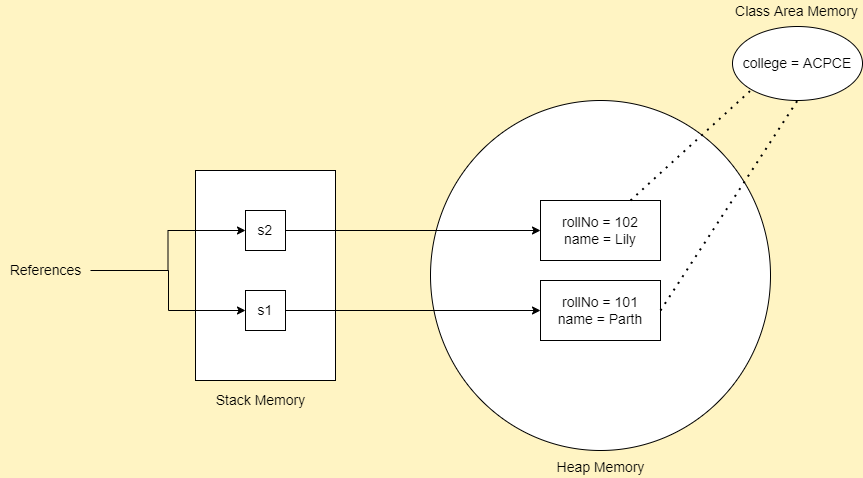

# `static` keyword

- Mainly used for memory management.
- Can be applied to variables, methods, blocks and nested classes.
- Belongs to class rather than instance of the class.

## Static variable

- A variable created with `static` keyword is called static variable.
- The static variable can be used to refer to the common property of all objects which is not unique for each object.
- For eg, college name will be same for all the students studying in a particular college.
- Every instance of that class shares the same static variable.
- If changes are made to that variable, all other instances will the effect of the change.
- The static variable gets memory only once during class loading.
- It makes memory efficient by saving memory.
- Also, when reading input using `Scanner`, declare it as static which allows all static methods to directly access it.

### Problem without static variable

```java
class Student {
  int rollNo;
  String name;
  String college = "ACPCE";
}
```

- Suppose there are 500 students in your college.
- Now, all instance data members will get memory each time when the object is created.
- All students have their unique `rollNo` and `name`, so instance data member is good in this case.
- Here, college refers to the property of all objects which is not unique for each object.
- Every time when an object is created, the college data member will get new memory and for 500 students 500 space of memory will be created.
- To make it more efficient we make college as `static`.

### Solution to the above problem

```java
// Student.java
class Student {
  int rollNo;
  String name;

  // Static variable
  static String college = "ACPCE";

  Student(int r, String n) {
    rollNo = r;
    name = n;
  }

  void display() {
    System.out.println(rollNo + " " + name + " " + college);
  }
}

// Main.java
class Main {
  public static void main(String args[]) {
    Student s1 = new Student(101, "Parth");
    Student s2 = new Student(102, "Lily");

    s1.display();
    s2.display();
  }
}
```

```
Output:
101 Parth ACPCE
102 Lily ACPCE
```



### Counter program without static variable

```java
class Counter {
  int count = 0;

  Counter() {
    count++;
    System.out.println(count);
  }

  public static void main(String args[]) {
    Counter c1 = new Counter();
    Counter c2 = new Counter();
    Counter c3 = new Counter();
  }
}
```

```
Output:
1
1
1
```

- Here we have created an instance variable named `count` which is incremented in the constructor.
- Since instance variable gets memory at the time of object creation, each object will have a copy of the instance variable.
- If it is incremented, it won't reflect in other objects.
- So each object will have counter value as 1.

### Counter program with static variable

```java
class Counter {
  static int count = 1;

  Counter() {
    count++;
    System.out.println(count);
  }

  public static void main(String args[]) {
    Counter c1 = new Counter();
    Counter c2 = new Counter();
    Counter c3 = new Counter();
  }
}
```

```
Output:
1
2
3
```

- Static variable will get memory only once.
- If any object changes the value of the static variable, it retains the changed value.

## Static method

- If you apply `static` keyword to any method, it becomes static method.
- A static method belongs more to the class.
- A static method can be invoked without creating the instance of the class.
- We can invoke using `ClassName.method()`
- A static method can access static data member and change the value of it.
- Can't access instance methods and instance variables directly.
- Usually used for operations that don't require any data from an instance of the class (from `this`).
- Cannot use `this` in static method.
- Whenever you see a method that does not use instance variable, that method should be declared as a static method.

```java
// Student.java
class Student {
  int rollNo;
  String name;
  static String college = "ACPCE";

  // static method to change the value of static variable
  static void changeCollege() {
    college = "IIT";
  }

  Student(int r, String n) {
    rollNo = r;
    name = n;
  }

  void display() {
    System.out.println(rollNo + " " + name + " " + college);
  }
}

// Main.java
public class Main {
  public static void main(String args[]) {
    Student s1 = new Student(101, "Parth");
    s1.display();
    Student s2 = new Student(102, "Lily");
    s2.display();

    System.out.println("Updating college");
    Student.changeCollege(); // calling static method
    s1.display();
    s2.display();
  }
}
```

```
Output:
101 Parth ACPCE
102 Lily ACPCE
Updating college
101 Parth IIT
102 Lily IIT
```

## `static` block

- Used to initialize the static data member.
- Executed before the `main()` method at the time of classloading.

```java
class A {
  static {
    System.out.println("Static block is invoked");
  }

  public static void main(String args[]) {
    System.out.println("Hello Parth");
  }
}
```

```
Output:
Static block is invoked
Hello Parth
```

## Important Questions

Q.1. Why is `main()` method static?
Ans. Because object is not required to invoke the `main()`. If it was non-static, JVM will have to create an object first then call `main()` which will lead to extra memory allocation.

Q.2. Can we execute a program without `main()` method?
Ans. No, previously there was a way to invoke it by using static block, but since JDK 1.7 it is not possible.
