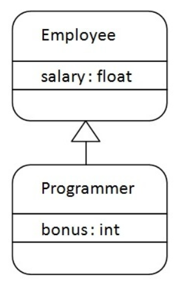
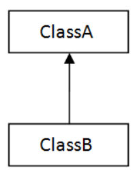
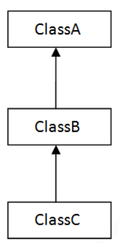
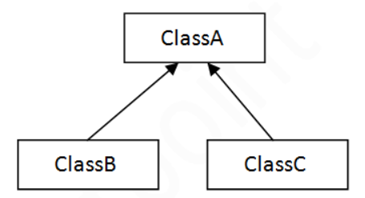
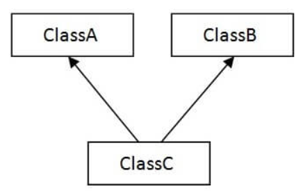
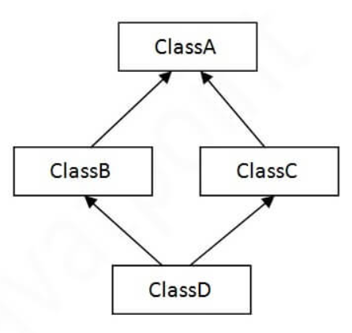

# Inheritance in Java

- Mechanism in which one object or class acquires all the properties and behavior of a parent object or class.
- You can create new classes that are built upon existing classes.
- When you inherit from existing class, you can also reuse the methods and data members of the parent class.
- Represents `IS-A` relationship which is also called as parent-child relationship.
- We use inheritance to improve the code reusability.

## Important terms used in Inheritance

- Sub class/ Child class: inherited class
- Super class/ Parent class: Class from which other classes are inherited

## Syntax:

```java
class subclass_name extends superclass_name {
  // statements
}
```

- `extends` keyword indicates that you are making a new class that derives from an existing class.
- The meaning of "extends" is to increase the functionality.

## Inheritance Example



- Programmer is the subclass and Employee is the superclass.
- The relationship between the two classes is Programmer IS-A Employee.
- It means that Programmer is a type of Employee.

```java
class Employee {
  double salary = 50000;
}

class Programmer extends Employee {
  public static void main(String args[]) {
    double bonus = 10000;

    Programmer programmer = new Programmer();
    System.out.println("Programmer's salary: " + programmer.salary);
    System.out.println("Bonus: " + bonus);
    System.out.println("Total: " + (programmer.salary + bonus));
  }
}
```

```
Output:
Programmer's salary: 50000.0
Bonus: 10000.0
Total: 60000.0
```

- Programmer object can access the field of own class as well as of Employee class i.e. code reusability.

## Types of Inheritance

### Single Inheritance



- When a class inherits another class, it is known as a single inheritance.

```java
class Animal {
  void eat() {
    System.out.println("Eating");
  }
}

class Dog extends Animal{
  void bark() {
    System.out.println("Barking");
  }
}

public class Main {
  public static void main(String args[]) {
    Dog dog = new Dog();
    dog.bark();
    dog.eat();
  }
}
```

```
Output:
Barking
Eating
```

### Multilevel Inheritance



- When there is a chain of inheritance, it is known as multilevel inheritance.

```java
class Animal {
  void eat() {
    System.out.println("Eating");
  }
}

class Dog extends Animal{
  void bark() {
    System.out.println("Barking");
  }
}

class Puppy extends Dog {
  void play() {
    System.out.println("Playing");
  }
}

public class Main {
  public static void main(String args[]) {
    Puppy puppy = new Puppy();
    puppy.bark();
    puppy.eat();
    puppy.play();
  }
}
```

```
Output:
Barking
Eating
Playing
```

### Hierarchical Inheritance



- When two or more classes inherits a single class, it is known as hierarchical inheritance.

```java
class Animal {
  void eat() {
    System.out.println("Eating");
  }
}

class Dog extends Animal {
  void bark() {
    System.out.println("Barking");
  }
}

class Cat extends Animal {
  void scratch() {
    System.out.println("Scratching");
  }
}

public class Main {
  public static void main(String[] args) {
    Dog dog = new Dog();
    Cat cat = new Cat();

    dog.eat();
    dog.bark();
    cat.eat();
    cat.scratch();

    // cat.bark(); Error
  }
}
```

```
Output:
Eating
Barking
Eating
Scratching
```

### Multiple Inheritance



- When one class inherits multiple classes, it is known as multiple inheritance.
- Not supported in Java through class to reduce the complexity and simplify the language.
- Consider a scenario where A, B, and C are three classes.
- The C class inherits A and B classes.
- If A and B classes have the same method and you call it from child class object, there will be ambiguity to call the method of A or B class.
- Since compile-time errors are better than runtime errors, Java renders compile-time error if you inherit 2 classes.
- So whether you have same method or different, there will be compile time error.

### Hybrid Inheritance



- Combination of any of the above inheritance, is called Hybrid Inheritance.
