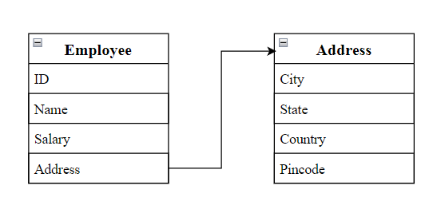

# Aggregation in Java

- Class having an entity as a reference is called as Aggregation.
- Represents `HAS-A` relationship.
- Consider for example, entity `Employee` contains data members as `ID`, `Name`, `Salary` and `Address`.
- Here, `Address` is another entity which contains data members as `City`, `State`, `Country` and `Pincode`.



- `Employee` has an entity reference `Address`, so relationship is `Employee` HAS-A `Address`.
- Code reuse is achieved.
- Inheritance should be used only if the relationship `IS-A` is maintained throughout the lifetime of the objects involved; otherwise, aggregation is the best choice.

## Example of aggregation

```java
// Address.java
public class Address {
  String city, state, country;
  int pincode;

  public Address(String city, String state, String country, int pincode) {
    this.city = city;
    this.state = state;
    this.country = country;
    this.pincode = pincode;
  }
}

// Employee.java
public class Employee {
  int id;
  String name;
  double salary;
  Address address;

  public Employee(int id, String name, double salary, Address address) {
    this.id = id;
    this.name = name;
    this.salary = salary;
    this.address = address;
  }

  void diplay() {
    System.out.println(id + " " + name + " " + salary);
    System.out.println(address.city + " " + address.state + " " + address.country + " " + address.pincode);
  }
}

// Main.java
public class Main {
  public static void main(String[] args) {
    Address address1 = new Address("Mumbai", "Maharashtra", "India", 400011);
    Address address2 = new Address("Surat", "Gujarat", "India", 335009);

    Employee employee1 = new Employee(101, "Parth", 50000, address1);
    Employee employee2 = new Employee(102, "Lily", 40000, address2);

    employee1.display();
    employee2.display();
  }
}
```

```
Output:
101 Parth 50000
Mumbai Maharashtra India 400011
102 Lily 40000
Surat Gujarat India 335009
```
