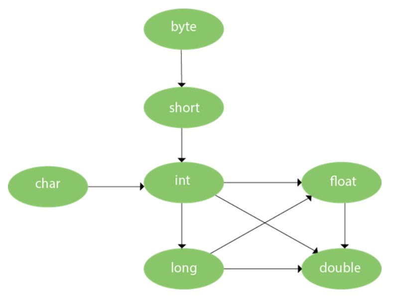

# Method overloading

- It is compile time polymorphism.
- If a class has multiple methods having same name but different parameters, it is called as Method overloading.
- It increases the readability of the code.
- There are two ways to overload a method:
  - By changing the number of arguments
  - By changing the data type of the arguments
- Method overloading is not possible by only changing the return type.

## Ways to overload a method

### 1. Changing number of arguments

```java
class Adder {
  static int add(int a, int b) {
    return a + b;
  }

  static int add(int a, int b, int c) {
    return a + b + c;
  }
}

class Main {
  public static void main(String args[]) {
    System.out.println(Adder.add(1, 2));
    System.out.println(Adder.add(1, 2, 3));
  }
}
```

```
Output:
3
6
```

### 2. Changing data type of arguments

```java
class Adder {
  static int add(int a, int b) {
    return a + b;
  }

  static double add(double a, double b, double c) {
    return a + b + c;
  }
}

class Main {
  public static void main(String args[]) {
    System.out.println(Adder.add(1, 2));
    System.out.println(Adder.add(1.0, 2.0, 3.0));
  }
}
```

```
Output:
3
6.0
```

## Important interview Questions

### Q. Why method overloading is not possible by changing only the return type of the method?

- Because it creates ambiguity.

```java
class Adder {
  static int add(int a, int b) {
    return a + b;
  }

  static double add(int a, int b) {
    return a + b;
  }
}

class Main {
  public static void main(String args[]) {
    System.out.println(Adder.add(1, 2)); // Creates ambiguity
  }
}
```

### Q. Can we overload `main()`?

- Yes, but JVM only calls `main()` which recieves string array as arguments.

```java
class Main {
  public static void main(String args[]) {
    System.out.println("main with String[]");
  }

  public static void main(String args) {
    System.out.println("main with String");
  }

  public static void main() {
    System.out.println("main without args");
  }
}
```

```
Output:
main with String[]
```

## Method Overloading and Type Promotion

- One type is promoted to another implicitly if no matching data type is found.
- One type is not de-promoted implicitly for example `double` cannot be depromoted to any type implicitly.



### Example of method overloading with type promotion

```java
class Main {
  void sum(int a, long b) {
    System.out.println(a + b);
  }

  void sum(int a, int b, int c) {
    System.out.println(a + b + c);
  }

  public static void main(String args[]) {
    Main obj = new Main();

    obj.sum(20, 20);
    obj.sum(20, 20, 20);
  }
}
```

```
Output:
40
60
```

### Example of method overloading with type promotion if matching found

- If there are matching type arguments in the method, type promotion is not performed.

```java
class Main {
  void sum(int a, int b) {
    System.out.println("int arg method invoked");
  }

  void sum(long a, long b) {
    System.out.println("long arg method invoked");
  }

  public static void main(String args[]) {
    Main obj = new Main();
    obj.sum(20, 20);
  }
}
```

```
Output:
int arg method invoked
```

### Example of method overloading with type promotion in case of ambiguity

- If there are no matching type arguments in the method, and each method promotes similar number of arguments, there will be ambiguity.

```java
class Main {
  void sum(int a, long b) {
    System.out.println("a method invoked");
  }

  void sum(long a, int b) {
    System.out.println("b method invoked");
  }

  public static void main(String args[]) {
    Main obj = new Main();
    obj.sum(20, 20); // Creates ambiguity and results in compile time error
  }
}
```
