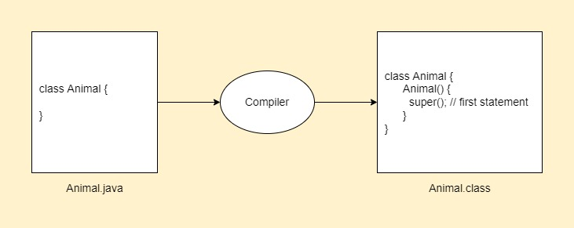

# `super()` call

- Used to invoke parent class constructor.

```java
class Animal {
  Animal() {
    System.out.println("Animal is created");
  }
}

class Dog extends Animal {
  Dog() {
    super();
    System.out.println("Dog is created");
  }
}

class Main {
  public static void main(String[] args) {
    Dog d = new Dog();
  }
}
```

```
Output:
Animal is created
Dog is created
```

- `super()` is added in each class constructor automatically by the compiler if there is no `super()` or `this()`.
- So the above code will work same way if we don't add `super()`.



## Real example

```java
class Person {
  int id;
  String name;

  Person(int id, String name) {
    this.id = id;
    this.name = name;
  }
}

class Employee extends Person {
  double salary;

  Employee(int id, String name, double salary) {
    super(id, name); // Reusing parent constructor
    this.salary = salary;
  }

  void display() {
    System.out.println(id + " " + name + " " + salary);
  }
}

class Main {
  public static void main(String[] args) {
    Employee e1 = new Employee(1, "ankit", 43000);
    e1.display(); // 1 ankit 43000
  }
}
```
