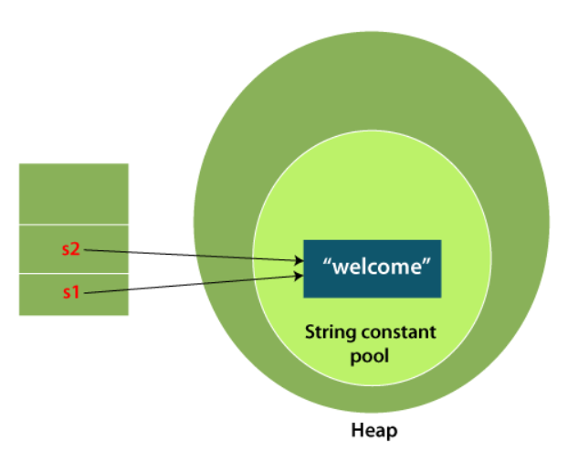
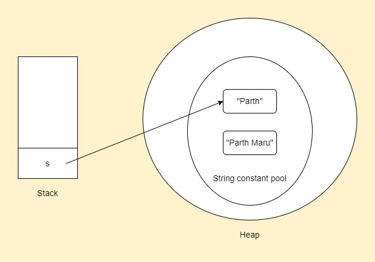

# Strings in Java

- An object used to represent sequence of character values.
- An array of characters works as same as string.

```java
char ch[] = {'p', 'a', 'r', 't', 'h'};
String s = new String(ch);

// is same as

String s = "parth";
```

- The `java.lang.String` class implements `Serializable`, `Comparable` and `CharSequence` interfaces.
- The `CharSequence` interface is used to represent the sequence of characters.
- We can create string with `String`, `StringBuffer` and `StringBuilder` classes as these classes implement `CharSequence` interface.

## Ways to create a string

### 1. String literal

- String is created using double quotes.

```java
String name = "Parth";

String s1 = "welcome";
String s2 = "welcome"; // Does not create a new instance
```

- Each time you create a string literal, the JVM checks the "string constant pool" first.
- If the string already exists in the pool, a reference to the pooled instance is returned.
- If the string doesn't exist in the pool, a new string instance is created and placed in the pool.
- String objects are stored in a special memory area known as the string constant pool.
- We use string literal to make Java more memory efficient as no new objects are created if it already exists in the string constant pool.



### 2. new keyword

```java
String s = new String("Parth");
```

- In such case, JVM will create a new string object in normal (non-pool) heap memory, and the literal "Parth" will be placed in the string constant pool.
- The variable s will refer to the object in a heap (non-pool).

## List of string class methods

| Method                                                                                  | Description                                                      |
| --------------------------------------------------------------------------------------- | ---------------------------------------------------------------- |
| `char charAt(int index)`                                                                | returns char value for the particular index                      |
| `int length`                                                                            | returns string length                                            |
| `static String format(String format, Object... args)`                                   | returns a formatter string                                       |
| `static String format(Locale l, String format, Object... args)`                         | returns formatted string with given locale                       |
| `String substring(int beginIndex)`                                                      | returns substring for given begin index                          |
| `String substring(int beginIndex, int endIndex)`                                        | returns substring for given begin index and end index            |
| `boolean contains(CharSequence s)`                                                      | returns true or false after matching the sequence of char value  |
| `static String join(CharSequence delimiter, CharSequence... elements)`                  | returns a joined string                                          |
| `static String join(CharSequence delimiter, Iterable<? extends CharSequence> elements)` | returns a joined string                                          |
| `boolean equals(Object another)`                                                        | checks the equality of string with the given object              |
| ` boolean isEmpty()`                                                                    | checks if string is empty                                        |
| `String concat(String str)`                                                             | concatenates the specified string                                |
| `String replace(char old, char new)`                                                    | replaces all occurrences of the specified char value             |
| `String replace(CharSequence old, CharSequence new)`                                    | replaces all occurrences of the specified CharSequence           |
| `static String equalsIgnoreCase(String another)`                                        | compares another string. It doesn't check case.                  |
| `String[] split(String regex)`                                                          | returns a split string matching regex                            |
| `String[] split(String regex, int limit)`                                               | returns a split string matching regex and limit                  |
| `String intern()`                                                                       | returns an interned string                                       |
| `int indexOf(int ch)`                                                                   | returns the specified char value index                           |
| `int indexOf(int ch, int fromIndex)`                                                    | returns the specified char value index starting with given index |
| `int indexOf(String substring)`                                                         | returns the specified substring index                            |
| `int indexOf(String substring, int fromIndex)`                                          | returns the specified substring index starting with given index  |
| `String toLowerCase()`                                                                  | returns a string in lowercase                                    |
| `String toLowerCase(Locale l)`                                                          | returns a string in lowercase using specified locale             |
| `String toUpperCase()`                                                                  | returns a string in uppercase                                    |
| `String toUpperCase(Locale l)`                                                          | returns a string in uppercase using specified locale             |
| `String trim()`                                                                         | removes beginning and ending spaces of this string               |
| `static String valueOf(int value)`                                                      | converts given type into string. It is an overloaded method.     |

## Immutable strings

- String objects are immutable which means unchangeable or unmodifiable.
- Once a string object is created its data or state can't be changed but a new string object is created.

```java
String s = "Parth";
s.concat(" Maru"); // concat() appends the string at the end
System.out.println(s); // Parth, because strings are immutable
```



- Here a new string object "Parth Maru" is created.
- s is still pointing to "Parth" as we haven't explicitly assigned it s.

```java
String s = "Parth";
s = s.concat(" Maru");
System.out.println(s); // Parth Maru
```

## Interview questions

1. Why string objects are immutable?

- Consider there are 5 reference variables all refering to object "Parth".
- If any one reference variable changes the value of the object, it will be affected by all the reference variables.
- That's the reason strings were made immutable.

2. Why String class is final?

- So that no one can override its methods.
- Hence it can provide the same features to the new String objects as well as the old ones.

## String comparison

- Three ways:

1. `equals()` method

- Method of string class.
- Compares two strings and returns boolean result.

```java
String s1 = "abc";
String s2 = "ABC";
String s3 = new String("abc");

System.out.println(s1.equals(s2)); // false
System.out.println(s1.equals(s3)); // true
```

- Another method is `equalsIgnoreCase()` which compares two strings and ignores the case.

```java
String s1 = "abc";
String s2 = "ABC";

System.out.println(s1.equalsIgnoreCase(s2)); // true
```

2. By using `==` operator

- `==` compares reference, not values.

```java
String s1 = "abc";
String s2 = "abc";
String s3 = new String("abc");

System.out.println(s1 == s2); // true
System.out.println(s1 == s3); // false, because s3 reference to string in heap and not string pool
```

3. By using `compareTo()` method

- Compares values lexicographically and returns integer value that describes if the first string is less than, equal to or greater than second string.
- Consider two string s1 and s2:
  - If s1 == s2, method returns 0.
  - If s1 > s2, method returns positive value.
  - If s1 < s2, method returns negative value.

```java
String s1 = "Parth";
String s2 = "Parth";
String s3 = new String("Maru");

System.out.println(s1.compareTo(s2)); // 0
System.out.println(s1.compareTo(s3)); // 3
System.out.println(s3.compareTo(s1)); // -3
```

# StringBuffer class

- Used to create mutable string objects.
- Java StringBuffer class is thread-safe i.e. multiple threads cannot access it simultaneously.
- So it is safe and will result in an order

## Important constructors of StringBuffer class

- `StringBuffer()`: Creates an empty string buffer with the initial capacity as 16.
- `StringBuffer(String str)`: Creates a string buffer with the specified string.
- `StringBuffer(int capacity)`: Creates an empty String buffer with the specified capacity as length.

## Important methods of StringBuffer class

1. `append()`

- Concatenates the given argument at the end of the string.

```java
StringBuffer sb = new StringBuffer("parth");
sb.append(" maru");
System.out.println(sb); // parth maru
```

2. `insert()`

- Insert string at a particular position.

```java
StringBuffer sb = new StringBuffer("parth");
sb.insert(0, "hello ");
System.out.println(sb); // hello parth
```

3. `replace()`

- Replaces the given string from a specified index to specified index.

```java
StringBuffer sb = new StringBuffer("abcd");
sb.replace(1, 3, "BC");
System.out.println(sb); // aBCd
```

4. `delete()`

- Deletes the string from the specified index to a specified index.

```java
StringBuffer sb = new StringBuffer("abcd");
sb.delete(1, 4);
System.out.println(sb); // a
```

5. `reverse()`

- Reverses the current string.

```java
StringBuffer sb = new StringBuffer("abcd");
sb.reverse();
System.out.println(sb); // dcba
```

6. `capacity()`

- Returns the current capacity of the buffer.
- Default capacity is 16.
- If the number of character increases from its current capacity, it increases the capacity by (old capacity \* 2) + 2.
- For eg, old capacity was 16, so the new capacity will be (16 \* 2) + 2 = 34.

```java
StringBuffer sb = new StringBuffer();
System.out.println(sb.capacity()); // 16

sb.append("parth");
System.out.println(sb.capacity()); // 16

sb.append("Java is my favorite language");
System.out.println(sb.capacity()); // 34
```

# StringBuilder class

- Used to create mutable strings.
- Same as StringBuffer, but it is non-synchronized.

## Important constructors of StringBuilder class

- `StringBuilder()` - Creates an empty StringBuilder with the initial capacity of 16.
- `StringBuilder(String str)` - Creates a StringBuilder with the specified string.
- `StringBuilder(int length)` - Creates an empty StringBuilder with the specified capacity as length.

## Important methods of StringBuilder class

1. `append()`

- Same as StringBuffer class.

```java
StringBuilder sb = new StringBuilder("parth");
sb = sb.append(" maru");
System.out.println(sb); // parth maru
```

2. `insert()`
3. `replace()`
4. `delete()`
5. `reverse()`
6. `capacity()`

- All the above methods work same as StringBuffer class.

# String vs StringBuffer

| String                                                                                                            | StringBuffer                                                 |
| ----------------------------------------------------------------------------------------------------------------- | ------------------------------------------------------------ |
| Immutable                                                                                                         | Mutable                                                      |
| Slow and consumes more memory when we concatenate too many strings because every time it creates new instance.    | Fast and consumes less memory when we concatenate t strings. |
| Overrides the equals() method of Object class. So you can compare the contents of two strings by equals() method. | Doesn't override the equals() method of Object class.        |
| Uses String constant pool.                                                                                        | Uses heap memory.                                            |

## Performance test of String and StringBuilder

1. Concatenation test

```java
public class Main {

	public static void main(String args[]) {
		long startTime = System.currentTimeMillis();

		concatWithString();
		System.out.println("concatWithString() -> " + (System.currentTimeMillis() - startTime) + "ms");

		startTime = System.currentTimeMillis();
		concatWithStringBuffer();
		System.out.println("concatWithStringBuffer() -> " + (System.currentTimeMillis() - startTime) + "ms");
	}

	public static String concatWithString() {
		String s = "parth";

		for(int i = 0; i < 10000; i++) {
			s = s + " maru ";
		}
		return s;
	}

	public static String concatWithStringBuffer() {
		StringBuffer s = new StringBuffer("parth");

		for(int i = 0; i < 1000; i++) {
			s.append(" maru" );
		}
		return s.toString();
	}
}
```

```
Output:
concatWithString() -> 146ms
concatWithStringBuffer() -> 1ms
```

- This proves that StringBuffer concatenates faster compared to String.

2. Hashcode test

```java
public class Main {

	public static void main(String args[]) {
		String str = "parth";
		System.out.println("String hashcode");
		System.out.println(str.hashCode());

		str = str + " maru";
		System.out.println(str.hashCode());


		StringBuffer sb = new StringBuffer("parth");
		System.out.println("StringBuffer hashcode");
		System.out.println(sb.hashCode());

		sb.append(" maru");
		System.out.println(sb.hashCode());
	}
}
```

```
Output:
String hashcode
106437333
-65644222
StringBuffer hashcode
1072591677
```

- This proves that StringBuffer is mutable and String is immutable.

# StringBuffer vs StringBuilder

| StringBuffer                                                                                               | StringBuilder                                                                                                     |
| ---------------------------------------------------------------------------------------------------------- | ----------------------------------------------------------------------------------------------------------------- |
| Synchronized i.e. thread safe. It means two threads can't call the methods of StringBuffer simultaneously. | Non-synchronized i.e. not thread safe. It means two threads can call the methods of StringBuilder simultaneously. |
| Less efficient than StringBuilder.                                                                         | More efficient than StringBuffer.                                                                                 |
